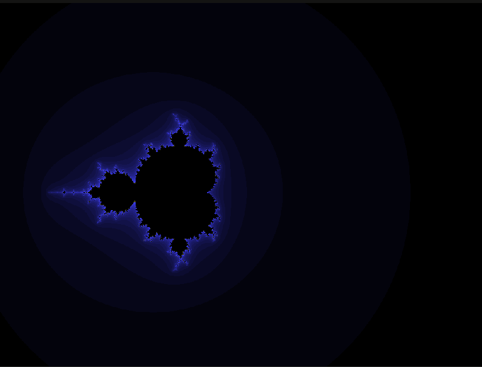

# Mandelbrot Set Visualization in C++ with SDL2

## Overview

This project visualizes the Mandelbrot set using C++ and the SDL2 library. It computes the set by iteratively applying the function:

`z_n+1 = z_n^2 + c`

over complex numbers and renders the resulting fractal in a graphical window.



## Features

*   Real-time rendering of the Mandelbrot set
*   Interactive zooming and panning
*   Customizable rendering parameters (e.g., maximum iterations, color schemes)
*   Cross-platform support (Windows, Linux, macOS)

## Prerequisites

*   C++17 compatible compiler (e.g., GCC, Clang, MSVC)
*   SDL2 library installed on your system

## Building the Project

### Windows

1.  Ensure SDL2 is installed and its `include` and `library` directories are accessible to your compiler.
2.  Open the **SDL\_Mandelbrot Set Project.sln** solution file in Visual Studio.
3.  Build the solution using your desired configuration (Debug/Release).

### Linux/macOS

1.  **Install SDL2 using your system's package manager:**

    *   **Ubuntu/Debian:**
        ```bash
        sudo apt-get install libsdl2-dev
        ```
    *   **Fedora:**
        ```bash
        sudo dnf install SDL2-devel
        ```
    *   **macOS (Homebrew):**
        ```bash
        brew install sdl2
        ```

2.  **Clone the repository:**
    ```bash
    git clone https://github.com/YogeshT22/Mandelbrot-Set-Project-Using-CPP.git
    cd Mandelbrot-Set-Project-Using-CPP
    ```

3.  **Compile the project:**
    ```bash
    g++ -std=c++17 -o mandelbrot src-git/main.cpp -lSDL2
    ```

## Running the Application

After successfully building the project, execute the compiled binary from the project's root directory (or wherever the binary is located):

```bash
./mandelbrot
```
A window will open displaying the Mandelbrot set.

5. Controls
   - Zoom In: Scroll up or press +
  - Zoom Out: Scroll down or press -
  - Pan: Arrow keys (←, →, ↑, ↓)
  - Reset View: Press r
  - Exit: Press Esc or close the window

6. Customization
You can modify rendering parameters such as:
  - Maximum iterations
  - Color schemes
  - Zoom sensitivity
  - Initial view coordinates
These settings can be adjusted in the main.cpp file.

### License
This project is licensed under the MIT License. See the LICENSE file for details.

### Acknowledgments
- SDL2 for providing the multimedia library
- <i>Inspired by various Manelbrot set visualizations and tutorials
